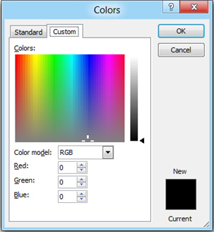

**Outlook 2013 and Outlook 2010** have feature known as **Search Folder** which allows users to **create new search** folder for **displaying** messages based on **criteria**. For example a search folder can be created to include all follow up flags and unread messages.

Click the **Folder** menu option in **Outlook Office Ribbon** then navigate to the New section. If you want to **create** a **search folder** that would list all the message with text Spam then click the New Search Folder. This would display

the following New Search Folder window. Then navigate to Custom section and select Create a **custom Search Folder**. To specify the **criteria** for the search

folder, click the **Choose** button and enter the name for your Custom Search Folder then Browse and select folder from which the mails will be included for Search Folder.

> Note :- This feature can do a search of only one mail account. If you have more than one mail account configured in your Outlook then you will have to create separate Custom Search Folder for individual mail accounts.

Clicking the Criteria button would then display the following **Search Folder Criteria** window. Enter “Spam” in Search for the word(s) field and click on OK button to save the entered Criteria.

Confirm the action by clicking OK button on Custom Search Folder window and New Search Folder window. Now a new search folder “Spam” will be available in Navigation Pane under the Search Folders with list of **message** containing the text Spam.

<iframe height="349" src="http://www.youtube.com/embed/9e4e5LpsFaM?hl=en&amp;fs=1" frameborder="0" width="425" allowfullscreen="allowfullscreen"></iframe>
