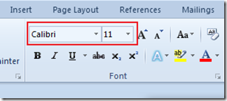
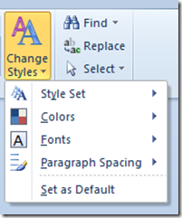
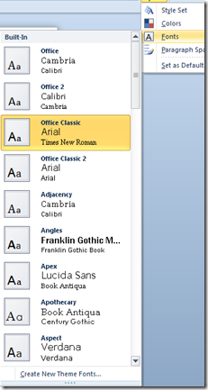

When you **select a text** in Microsoft **Word 2013 and Word 2010** a **mini toolbar** would appear as shown below. Initially it will be displayed as faded one but after hovering the mouse over it will display the complete mini toolbar. The mini toolbar provides formatting options such as Font change, Font Colour, Highlight, Format Painter etc..

But if you do not want this to appear on selecting the text in a word document then you can use the Word General Options to **disable** the **mini toolbar**.

Click the File menu and then the options link.

In the Word Options screen, navigate to **General tab** then to the **User Interface Options**. By un marking the check box with label as **Show Mini Toolbar** on selection you can **disable the mini toolbar** in Word 2010. This would only **hide** the mini toolbar on text selection only and not while displaying the Context menu.
