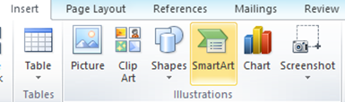

**Outlook 2013 and Outlook 2010** allow users to create rules based on the **sender**, **recipients** or **conversation** of the **topic message** and **move mail** to **different folder**. If you have created lot of rules and want to take a **backup** or **copy** these rules to another PC then you can use the **Export Rules** options.

In the Home menu, navigate to move section and the click the down arrow below Rules menu option.

Select Manage Rules & Alerts option form the list of available menus.

In the **Rules and Alerts** window, click on Options

The Rules Options window will displayed as shown below. To export the rules click on Export Rules button

In **Save Exported Rules** as dialog box, specify the File name and click on Save button. This would now export all the Outlook 2013 and Outlook 2010 rules in to a **Rules Wizard rules (.rwz)** file.

