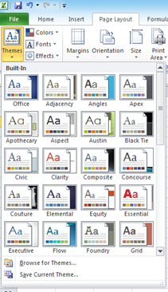

**Excel 2013 and Excel 2010** allow users to **hide formula** used in a Worksheet. You can use this feature when you want to prevent any one from accidentally changing the entered formula.

Let us say you want to hide the formula (=SUM(F5:F8)) which has been used in the bellow example.

Select the cell where the formula has been entered and navigate to **Format** menu and click the **Format Cell** menu option (You can also right click and select Format Cell in the Context menu).

In the Format Cell window, navigate to **Protection** tab and tick the checkbox with Label as **Hidden**. Click the Ok button to save the changes.

Then right click on the Sheet and select **Protect Sheet** from the list of available menu option.

In the Protect Sheet window, tick the check box with label as Protect worksheet and contents of locked cells.

If you want to just **hide formula** then it is not needed to password protect the sheet. Click Ok button to save the changes.

Now when you navigate to the Formula Cell, the formula bar will not displayed any information.

Bu this you can prevent excel users from seeing formula used in the worksheet.
