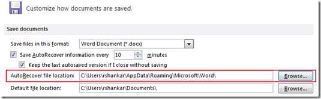

Microsoft has an **auto recover feature** using which a **word document can be retrieved** after an unplanned disruptions, such as a power outage or a crash. The word document gets saved to a default location during such as disruptions. If you want to change the default Auto Recover file location then you can use Word Advanced Options. Listed below procedure to change the default auto recover location in Word 2007, Word 2010 and Word 2013.

**Change auto recover file location in Word 2013 and Word 2010**

To the **change the default Auto Recover file location** in **Word 2010 and Word 2013**, click the File menu –> Options link. And then navigate to the Save tab. Under the Save documents, there is option for for specifying the Auto recover file location. This can be done by typing the required folder location in the text field available next to the label Auto Recover file location. You can also use the Browse button to locate the required folder. After the specifying the folder, click OK to apply the changes to the file location.

**Auto Recover file location in Word 2007**

The settings in Word 2007 can be accessed through **Word Options** -> **Save** menu

Under Save documents section, navigate to **AutoRecover file location** and specify the new location.

**Also See**: [How to recover saved WiFi password on WIndows 7](http://blogmines.com/blog/how-to-recover-saved-wifi-password-on-windows-7/)
