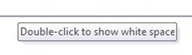
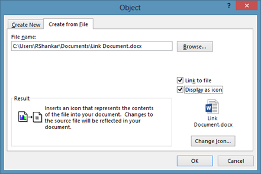

**Microsoft Outlook 2013 and Outlook 2010** has option to **automatically send or receive emails** at a specified time interval. It also provides option to change this time period using the **Send/Receive settings**. List below are the steps to change send and receive email settings in Outlook 2013 and Outlook 2010.

#### Change send and receive email settings in Outlook 2013 and Outlook 2010

Click on the File menu –> Options

Navigate to Advanced tab and scrolled down to Send and receive section. Then click on the Send/Receive button.

#### How to hide send and receive progress dialog in Outlook 2013 and Outlook 2010

Using the **Schedule an automatic send/receive every minutes** field you can specify the time period at which the automatic send/receive emails needs to be done. The default value for this is 30 minutes.

Outlook 2010 displays a send and receive dialog box showing the progress of mails received and sent from the email Accounts. If you have configured more than one email accounts in Outlook then the time taken to complete Send/Receive will be more and the progress dialog will be displayed till the process is completed. Outlook provides allows users to hide the Send/Receive Progress. If you want to hide the dialog box then tick the check box with label as Don’t show this dialog box during Send/Receive.

Similarly if you want to turn on the display of progress message back then navigate to Send / Receive menu option and click the Show Progress option available under the Download section.

#### Change receive emails time for single mail account in Outlook 2013 and Outlook 2010

When you have more than one [email account configured](http://blogmines.com/blog/2008/02/09/configure-microsoft-outlook-yahoo-hotmail/) in Outlook 2010 and you want to specify a different send and receive time for a single account then you can follow the below mentioned steps.

Click the Send / Receive menu and navigate to Send & Receive section. Select **Define Send/Receive Groups** from the Send/Receive Groups menu list.

In the Send/Receive Groups window, you can see the default time specified in “Schedule an automatic send/receive” option for All Accounts.

Now click the New button and specify a name for the group. In the below example, I want to specify a change the send and receive time for my Yahoo account and I have named the group as Yahoo.

Then select the Account (Yahoo) in the Account section and click the Ok button.

Now change the value for “**Schedule an automatic send/receive every**” option for the Yahoo group and click the Close button.

**Also See**: [How to quickly block a sender in Outlook](http://blogmines.com/blog/how-to-quickly-block-a-sender-in-outlook-2010/)
