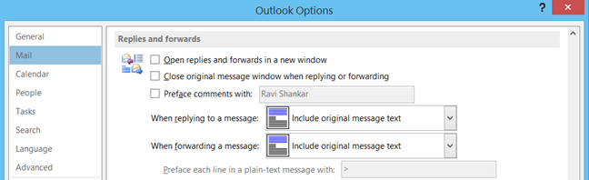

Windows 10 users can find out system details such **processor, installed RAM, system type** etc. using the Option available as part of Settings. This option will also provide users to **change name of the PC** or **join a new domain**.

**Step 1**: Click Windows 10 Start button or Windows icon

**Step 2**: Select the Settings from the menu list.

**Step 3**: In the Setting screen, click System option.

**Step 4**: Navigate to About tab under System setting screen. This should list all details about Windows 10 system.

