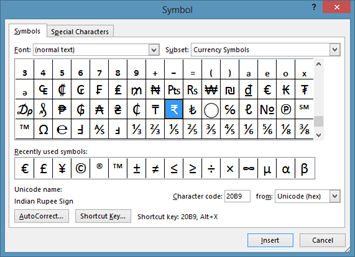

When you are running out disk space on windows 10 system, you can clean up unwanted apps in Windows 10 to free some space. Listed below are the steps to **View the App Size in Windows 10**

**Step 1**: Click Windows icon or Start button in Windows 10

**Step 2**: Select Settings from the menu list.

**Step 3**: In the Settings screen, select System option.

**Step 4**: Click the App & features section in System Settings. The system might take some time to list down the apps with their size. You can use the filter option to sort app based on size, name and installation date.

To remove any app, click Uninstall button which gets displayed when you select any app.

By following the above steps, you can find the size and uninstall an app in any Windows 10.
