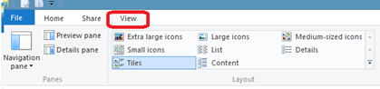
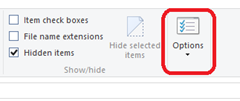

Microsoft Edge is the new Internet browser that has replaced Internet Explorer in Windows 10. When you start Microsoft Edge, by default it starts with Top sites.

Listed below are the steps to **start Microsoft Edge with Blank Web page**.

**Step 1**: Start Microsoft Edge and click More actions option available at the Top left hand corner.

**Step 2**: Select Settings from the drop down list.

**Step 3**: In the Open with radio option, select New tab page option.

**Step 4**: Navigate to Open new tabs with section and click the drop down.

**Step 5**: Select A blank page from the list of available option.

Now when you restart Microsoft Edge, it should start with a blank page.
