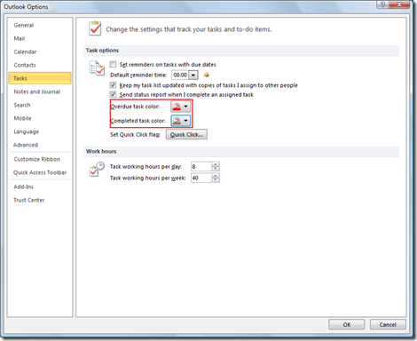
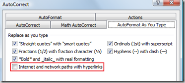
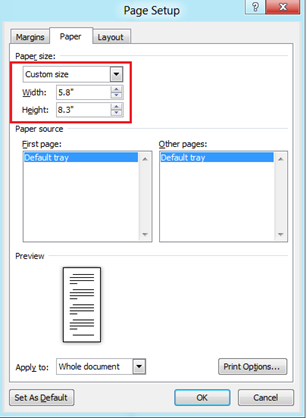

  
Here are some of the features and customization related with tasks in Outlook 2016, Outlook 2013, Outlook 2010 and Outlook 2007.

### Changing task status color

A task in outlook has different status associated with it like **Not Started**, **In Progress**, **Completed**, **Waiting for some one else** and **Deferred** . Outlook 2013 and Outlook 2010 provide option for **changing overdue task colour** and **completed task colour** from their default colour. Listed below are the steps to **change task status color in Outlook**

Click on the File menu and select option from the list. In the Outlook Options window, navigate to Tasks tab.

Under Task options the settings for changing colour for **Overdue and Completed task** are available. You can set your desired colour using these options.

Demo Video - **Change task status colour in Outlook 2010**  

\[embed height="315" width="560"\]http://www.youtube.com/embed/xiEBLWKk5Gs\[/embed\]

### Unhide task list

This tutorial provides the steps for **unhiding the task list** in **Outlook**. The task list is shown on the right hand sidebar below the **Appointments** section. And if you do not see the task list in your Outlook 2010 then you can do the following

Click the View menu, navigate to **Layout** section and then click the down arrow available below the **To-Do Bar menu option**. From the displayed menu list make sure to select **Task List** Option.

This would display the Task list below the Appointment section as shown below.

### Changing default reminder time for task

In  **Outlook**, when a task items are created, the **default reminder time** is set as 08:00 A.M. Using Outlook options you can change this default time.

Click on the File menu –> **options** and select Tasks link on the left hand side.

Under Task options section, there is dropdown available next to a label **Default reminder time**. Using this dropdown you can change the default reminder time to your choice. 

### Changing task work hours in Outlook

**Task’s work hours** in **Outlook 2010** can **changed** using Outlook Options.  
  
Click on the File menu –> select Options link and navigate to Tasks tab in Outlook Options window  

Under Work hours section, using **Task working hours per day** and  **Task working hours per week** you can set the working hours per day or week respectively.
