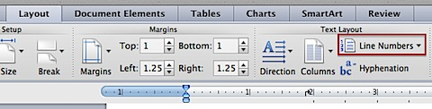
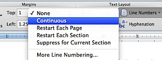

Microsoft Word users can add line numbers to a word document using the options available as part of **Page Layout** menu. In this tutorial we will see the steps for **adding line number in Word 2013 and Word 2011 for Ma**c.

#### How to add line numbers in Word 2007, Word 2010, Word 2013 and Word 2011 for Mac

**Word 2007 Word 2010 and Word 2013**

**Word 2010** allows users to **add line numbers** to a **word document**. This can be done using the **Page Layout menu** option. For example if you have the following text in your document and you want insert line numbers for each line then you use this feature.

To add line numbers for above paragraph, from Home menu click the Page Layout menu option and then navigate to Page Setup section.

In the Page Layout section, click the drop down arrow next to Line Numbers menu option. This would display the following menu options.

Now select Continuous from the list available menus and this would insert the line numbers in the Word document as shown below

The other line numbers options includes

- Restart Each Page – To restart line numbers after each page.
- Restart Each Section – To restart line numbers after each section.
- Suppress for Current Paragraph – to remove line numbers for the selected paragraph.

**Word 2011 for Mac**

**Step 1**: Open the document for which you want to add line number.

**Step 2**: Click Layout menu and navigate to **Text Layout** section.

**Step 3**: Now click the **Line Numbers** option under Text Layout. This should display the following drop down list.

**Step 4**: Select **Continuous** from the Line numbers drop down list to add line numbers. You can also customise Line numbers by use other options in the list.

If you are looking for advanced line number options then click More Line Numbering.

#### Display of line number in [status bar](http://blogmines.com/blog/2010/09/25/what-is-a-status-bar-in-microsoft-word-2010-document/)

If you just want to find out the **current line number** while editing a document then you can use line number option available as part of status bar for this purpose.

**Word 2007, Word 2010 and Word 2013**

Microsoft **Word 2007** and **Word 2010** provides option to **display the line numbers in a word document**. This would be a useful feature when you want to restrict your content based on the **number of lines** written in the document. If the **status bar** does not **show** **the line numbers**, then right click on the Status bar and select Line number.

After selecting Line Number option in the Customize Status Bar context menu, the status bar would display the line number as shown below.

**Word 2011 for Mac**

Word 2011 for Mac does not support the display of line number in status bar. This option is available in Window’s version of Microsoft Word but not in Mac OS X.

**Also See**: [How to auto populate random sentences in Word 2010](http://blogmines.com/blog/how-to-auto-populate-random-sentences-in-word-2010/)
