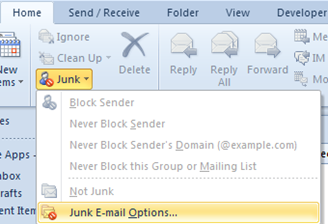
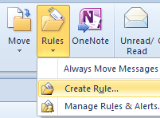
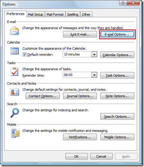
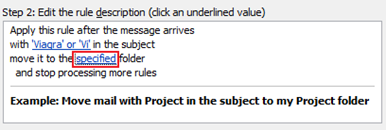
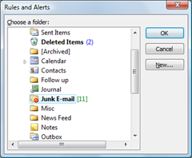

This post is reply to a query asked by a [Digital Answers](http://blogmines.com/blog/2011/01/19/how-to-quickly-block-a-sender-in-outlook-2010/#comment-244010) reader <Thanks Brian>

> Please tell me how to block a persistent group of junk mail senders. I have tried by "blocking sender" over 400 times without success. I get 10 t0 25 emails daily promoting "Viagra" and they keep changing the senders name and subject but nearly always include the words "sex"or "Viagra"or "Vigr" in the subject. Can we block the sender by somehow blocking those words?

**Block emails by blocking domain**

I am not aware of blocking emails based on the subject but you can try to block the domain name completely instead of email address. You can do this using the Junk Email Options.

Click the down available below the Junk Option under Delete section and select Junk E-mail Options from the drop down list

In the Junk Email Options window, navigate to Blocked Senders tab. For example, if you are receiving junk emails from senders with domain as “xx.com” then you can Add them to the blocked list using the Add button.

**Block emails by creating Outlook Rules**

The other best solution is to **create rules to block all the emails** based on their subject and move them to Junk E-mail folder

Navigate to Move section under Home menu then click the arrow pointing downwards available below the Rules Option and select **Manage Rules & Alerts** from the menu list.

In the Manage Rules & Alerts window, click the New Rule button.

Select “Move messages with specific words in the subject to a folder” and click specific words link available under the Edit the rule description.

In the Search Text window, enter the text that needs to checked with the email subject.

Now click specified link available under the **Edit the rule description** and choose the folder where you want to move these emails.

After specifying the folder, click Next until the **Finish rule setup** screen is displayed.

Then specify a name for this rule and click Finish button. Now any emails with specified text will be moved to Junk E-mail folder. These are some of the methods by which you can blocks emails in Outlook 2016, Outlook 2013 and Outlook 2010
