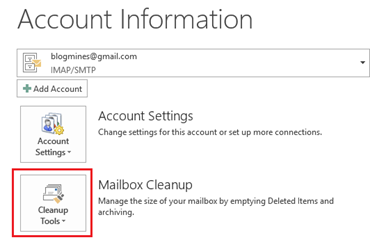
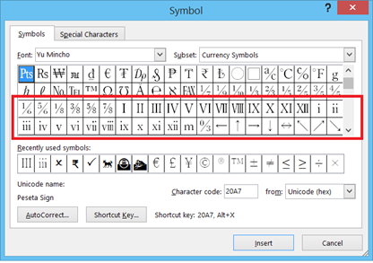
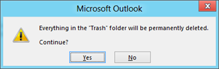

This is tutorial provides instruction for **clearing all the items** in **Outlook 2016 & Outlook 2013** **trash** folder.

**Step 1**: Click the Outlook File menu then navigate to Info section.

**Step 2**: In the Account Information screen, navigate to **Mailbox Cleanup** section and click the Cleanup Tools arrow pointing downwards.

**Step 3**: Select **Empty Deleted Items Folder** from the Cleanup Tools drop down list. 

**Step 4**: Click the Yes button to permanently delete all the items in the Trash folder.

When you have lots of items in your trash folder and want to clean up on a single click then you can use this feature.
