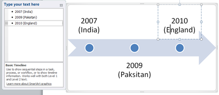

Word 2016, 2013 & 2010 have a feature that helps users to **create timeline** in a **Word document**. Listed below the steps that can be followed for creating a timeline.

**Step 1**: Navigate to Insert menu, click the **SmartArt** option under **Illustrations** section

**Step 2**: This would display the following Choose a **SmartArt Graphic window** as shown below.

**Step 3**: Click the Process section then scroll down and select a timeline option.

You can either select **Circle Accent Timeline** or **Basic Timeline**.

**Step 4**: A window for typing the timeline text will be displayed along with the Timeline as shown below. This window allows you to type the text for the timeline.

For example if you wanted to make a timeline for Word Cup T20 Cricket Winners.

A finished timeline will look as shown below.

