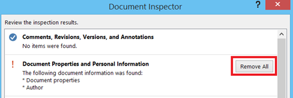

We had earlier seen about the steps required to [insert bookmark](http://blogmines.com/blog/2011/05/14/how-to-create-bookmark-in-word-2010/) in Word 2016, 2013 & 2010. This article explains the **different ways** to find out and **navigate** to bookmarks in a Word document.

### Bookmark Option

Users can quickly launch the Bookmark option by pressing **Ctrl + Shift + F5**. Bookmark option allows users to create new bookmark as well as navigate to existing bookmark. In the Bookmark option window, you can navigate to a bookmark by either by double clicking on the name or by selecting the name then clicking the Go To button.

### Find and Replace Dialog

Users can also navigate to bookmark using the Find and Replace dialog. Press F5 to launch Find and Replace dialog, then click GoTo tab and enter bookmark name and press Enter.

And if you have created many bookmarks and don’t remember the name of the bookmark then you can you pick it from the bookmark list. In the Go to what option, select Bookmark from the option list. A drop down list would be appear below the Enter bookmark name with list of available bookmarks. Pick the bookmark name from the list and click the Go To option.

