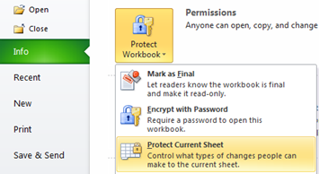

We had already seen the following tutorials related with **protection of worksheet** in **Excel 2016, 2013 & 2010**.

- [Prevent users from adding new worksheet](http://blogmines.com/blog/2011/01/27/how-to-prevent-users-from-adding-new-worksheet-in-excel-2010/).
- [Password Protect Worksheet](http://blogmines.com/blog/2010/09/07/how-to-password-protect-a-excel-2010-worksheet/) in Excel.
- [Unprotect Worksheet](http://blogmines.com/blog/2011/08/26/how-to-unprotect-a-sheet-in-excel-2010/) in Excel.

And if a worksheet with auto filter is protected then users will not be able to use auto filter unless it is enabled while protecting the worksheet. This tutorial is about the steps required for **enabling auto filter** for a protected worksheet in Excel 2010.

Click the Protect Sheet option available under Review menu or Info menu.

### Review Menu

Click Review menu –> Changes –> Protect Sheet

### Info Menu

Click File menu –> Info menu –> Protect Workbook –> Protect Current Sheet.

On clicking the **Protect Sheet** option would display the following Protect Sheet window.

Scroll down the “Allow all users of this worksheet to” list and make sure to tick the check box with caption as “Use AutoFilter”. Click OK button to confirm and save the changes.

Now excel users will be able to use the auto filter option even in a protected worksheet.

