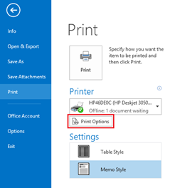

**Outlook 2016, 2013 and Outlook 2010** allow users to quickly print email & attachments using **quick print** options available as part of context menu. This is quite useful when you do not want to open an email and print the attachments.

### Enable default printer

First you need to enable the default printer under Print options. Click File menu –> Print

In the Print screen, click Print Options button and mark the check box with caption as “Print attached files. Attachments will print to the default printer only.”

### Quick Print in Outlook 2013 and Outlook 2010

Now you can navigate to the email with attachment. Right click and select Quick Print from the right click context menu.

