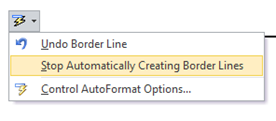

**Word 2016, 2013 and 2010** have a feature that allows users to **automatically create border lines** by just typing the character three times. For example if you type dash (-) three times and press enter key in a document, Word will automatically draw a border line with dash character. This is useful when your want to quickly draw border lines in your document.  

### AutoFormat As You Type – Border lines

Word application allows also users to turn off this feature using the Proofing options. Click the File menu then Options link. In Word Options window, click AutoCorrect options button under Proofing tab.

Then in the AutoCorrect window, navigate to Apply as you type section under AutoFormat As You Type tab. Now un mark the check box with label as Border lines. Click Ok button to confirm and save the changes.

### Quickly turn off border line feature

You can quickly turn off border line feature using the AutoCorrect Context menu Options. Type the character 3 times and press enter to draw the border line. Now select **“Stop Automatically Creating Border lines**” option from the drop down list.

If you want to **temporarily stop creating border line** just for one or two occurrences then you press **Ctrl + Z** to undo the changes.
