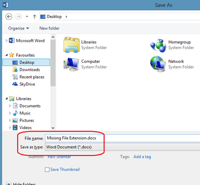

If you are working on Word 2016 or Word 2013 on Windows 7/8/10 operating system then while saving the document by default the file extension will not be displayed.

Listed below are the steps to make **Word 2016 and Word 2013 to display the file extension on Windows 8**.

**Step 1**: Launch Windows Explorer on Windows 8.

**Step 2**: Navigate to the View tab in Windows Explorer and click Options

**Step 3**: Then select “Change folder and search options” under Options.

**Step 4**: In the Folder Options window, navigate to Advanced Settings under View tab. Then unmark the checkbox with label as “**Hide extensions for known file types**”.

Click OK button to confirm and save the changes. Now when you try to save any Word document, you will notice the file extension as part of the file name in Save dialog.

\[embed height="315" width="420"\]http://www.youtube.com/embed/BTkBQW371yI\[/embed\]
