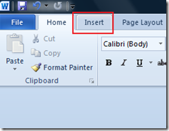

This is a short tutorial on **Adding** or **inserting** a **new page** in **Word 2016, 2013 and 2010.** This can be done using the options available as part of the **Insert menu** Word. To **add** a **new page** in a Word 2010 document, point the cursor to the place where you want to insert a page.

Navigate to the Insert menu and click the Blank Page menu option available as part of the Pages section.

This would insert a new page at place where the cursor placed before.
