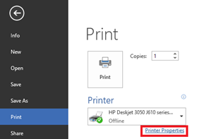

All programs do not provide option to choose the colour for printing pages. Word 2016 and Word 2013 users can print their **coloured document in black and white** using the option available as part of the Printer properties.

**Step 1**: Click the Fie menu and select Print from menu list.

**Step 2**: Navigate to Printer section and click the Printer Properties.

**Step 3**: In the Printer Properties window, click the Paper/Quality tab.

**Step 4**: Navigate to Colour section and mark the radio option with caption as Black & White. Then click OK button to confirm and save the changes.
