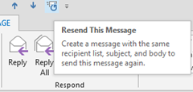

This tutorial is about the steps required to add “Resend This Message” and “[Recall This Message”](http://blogmines.com/blog/2010/06/10/how-to-recall-a-email-message-in-outlook-2010/) to Quick Access Toolbar in Outlook 2016 & 2013. If you are frequently going to use resend and recall option then you can add it to QAT.

**Step 1**: Launch Outlook 2013, navigate to Sent emails folder.

**Step 2**: Open any sent message and navigate to Move section.

**Step 3**: Click the Action drop down menu and Right click on Resend This Message menu option and select Add to Quick Access Toolbar from the right click menu list.

This should add **Resend This Message to Quick Access Toolbar** in Outlook 2013.

**Step 4**: Repeat the above step and choose Recall This Message from the Action dropdown for adding it to the Quick Access Toolbar.

