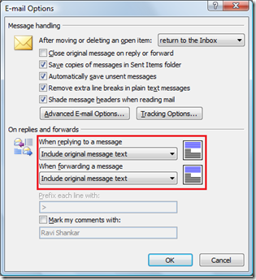

Microsoft Outlook users can **include the original message** while **forwarding or replying to an email**. The users can choose any one of the following options for original message

- Do not include original message
- Attach original message
- Include original message text
- Include and indent original message text
- Prefix each line of the original message 

Listed below are the steps to access the message handling option in Outlook 2013, Outlook 2010 and Outlook 2007

**Include original message in Outlook 2016, Outlook 2013 and Outlook 2010** Click File menu, select Options from the list.

In the Outlook Options window, click Mail tab then scroll down Replies and and forwards section.

Use the option “When replying to a message” and “When forward a message” to specify the option for original message.

**Include original message in Outlook 2007**

**Tools** -> **Options** -> **Email Options** -> **On replies and forwards** section

Using the drop down available under when replying to a message and When forwarding a message, you can choose any of the following values from drop down.

**Also See**: [Close original message on reply or forward in Microsoft Outlook](http://blogmines.com/blog/microsoft-office-outlook-close-original-message-on-reply-or-forward/)
