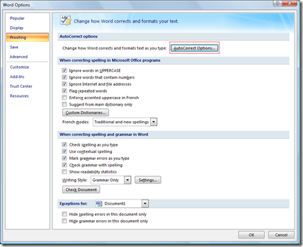
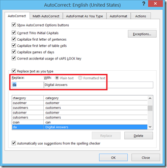
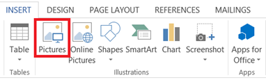
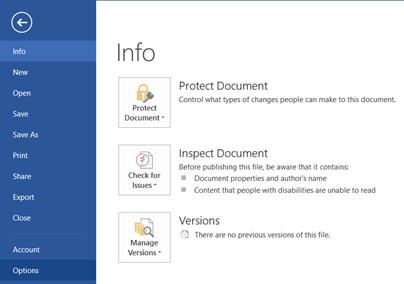

Autocorrect in **Microsoft Word 2016, Word 2013, 2010 and 2007** has a feature called **replace any text as you type.** This tutorial provides an example for replacing text with text and image in Word document.

**Replace text as you type in Word 2016, Word 2013, Word 2010 and Word 2007**

In Word 2013 and Word 2010 you can access Proofing section by clicking File menu –> Options. To access AutoCorrect option in Word 2007 click on the **Word Options** and navigate to Proofing section.

And on clicking the AutoCorrect Options the following dialog box would be displayed. Under **Replace text as you type**, you can add the text which needs to be replaced it is typed in the Word Document.

For example if you want dato be replaced with Digital Answers in word document, then add da to the left hand side and [Digital Answers](http://blogmines.com/blog) to right hand side then click **Add** button.

**How to use autocorrect for replacing text with picture**

**Step 1**: Navigate to Insert menu, click **Pictures** under illustrations section

**Step 2**: Using the Insert Picture dialog, select and add image to the document.

**Step 3**: Click File menu, select Options from the menu list.

**Step 4**: In Word Option window, navigate to **Proofing** section and click **AutoCorrect** Options.

**Step 5**: Now enter the name under **Replace text** and make sure **Formatted Text** radio option is selected. (If you have not selected any image then this option will not be displayed)

**Step 6**: Click Add button to add the entry to AutoCorrect list. Then OK button on the AutoCorrect and Word Options to close the windows.

Now whenever you type the replace text, it will be automatically replaced with the image. If you are frequently going to insert company logo or your signature then you try this feature.

**Also See**: [Find Autocorrect entries file in Word 2010](http://blogmines.com/blog/find-autocorrect-entries-file-in-word-2010/)
