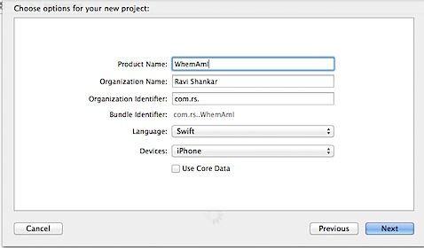
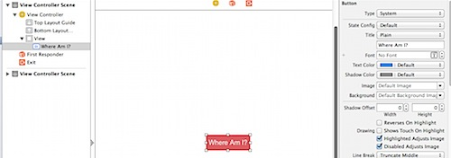
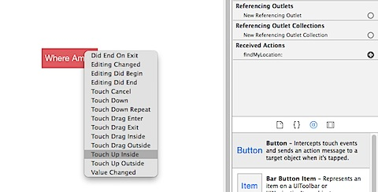
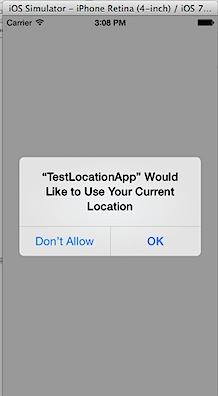
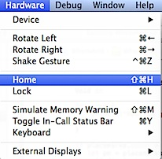
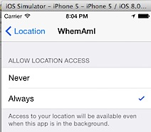
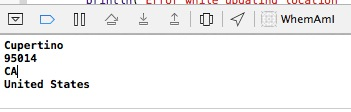
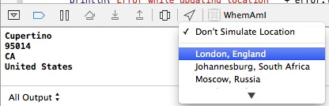

In this Swift tutorial, we will see the steps required for using **CoreLocation framework** and retrieve the latitude and longitude of the location. Then use the **CLGeocoder** to reverse geocode the latitude and longitude details. This is a very basic tutorial that retrieves the location details on tap of a button and displays the information on the screen.

**Updated** :- The source has now been to updated to show the address details in TextFields.

Click File -> New and select Project sub menu list.


In the Choose a template screen, select Single View Application and click Next button.


Enter the product name as WhereAmI and select the language as Swift then click Next. Select a folder and create the new project and that folder.



Navigate to ViewController.swift file and add a new function with name as findMyLocation after viewDidLoad function.

```
@IBAction func findMyLocation(sender: AnyObject) {

}
```

Navigate to Main.storyboard file, drag and drop Button from the Object Library on to the View Controller. Using the attributes inspector, change the name of the button to “Where Am I?”. If you need then change the background and text colour for the button. Then centre align the button both vertically and horizontally. Use the Resolve Auto Layout Option and pick **Reset to Suggested Constraints**.



Navigate to **Connections Inspector** and connect the button to the findMyLocation action under Received Actions (Touch Up Inside event).



Click the Project under Project Navigator and navigate to Build Phases. Click the + sign under **Link Binary With Libraries** and pick **CoreLocation.framework** from the list.


**CoreLocation in Swift**

Now navigate back to ViewController.swift file, add import CoreLocation after UIKit. Then we need to assign the current class as the delegate for `CLLocationManagerDelegate`. This is required because we will be using couple of delegate methods from CLLocationManager.

```
class ViewController: UIViewController, CLLocationManagerDelegate {
```

Define a constant for CLLocationManager after the class declaration.

```
let locationManager = CLLocationManager()
```

Navigate to **IBAction function findMyLocation** and add the following code

```
locationManager.delegate = self
locationManager.desiredAccuracy = kCLLocationAccuracyBest
locationManager.requestWhenInUseAuthorization()
locationManager.startUpdatingLocation()
```

The above lines sets the class as delegate for locationManager, specifies the location accuracy and starts receiving location updates from CoreLocation. In order to get the location updates we need to implement the delegate functions of CLLocationManager, didUpdateLocations and didFailWithError

```
func locationManager(manager: CLLocationManager!, didUpdateLocations locations: [AnyObject]!) {
}

func locationManager(manager: CLLocationManager!, didFailWithError error: NSError!) {
}

```

didUpdateLocations function is triggered when new location updates are available. Similarly didFailWithError is called when there is a problem receiving the location updates. Let us first start implementing the simpler one i.e didFailWithError function. When there is an error, we are going to log the message to the console.

```
func locationManager(manager: CLLocationManager!, didFailWithError error: NSError!) {
	println("Error while updating location " + error.localizedDescription)
}
```

Then update didUpdateLocations function with the following code, also add a new function for printing the location details.

```
func locationManager(manager: CLLocationManager!, didUpdateLocations locations: [AnyObject]!) {
CLGeocoder().reverseGeocodeLocation(manager.location, completionHandler: {(placemarks, error)->Void in
		if error {
			println("Reverse geocoder failed with error" + error.localizedDescription)
			return
		}

		if placemarks.count > 0 {
			let pm = placemarks[0] as CLPlacemark
			self.displayLocationInfo(pm)
		} else {
			println("Problem with the data received from geocoder")
		}
	})
}

func displayLocationInfo(placemark: CLPlacemark) {
	if placemark != nil {
		//stop updating location to save battery life
		locationManager.stopUpdatingLocation()
		println(placemark.locality ? placemark.locality : "")
		println(placemark.postalCode ? placemark.postalCode : "")
		println(placemark.administrativeArea ? placemark.administrativeArea : "")
		println(placemark.country ? placemark.country : "")
	}
}

```

in the `didUpdateLocations` function, we pass the location co-ordinates to

```
 CLGeocoder().reverseGeocodeLocation
```

. Then check for error and process the location array (placemarks). Then for displaying the location details, we pass the placemark detail to displayLocationInfo function.

### Add key to Info.plist for request permission to User’s location

In order to use the user’s location you need to request permission from the user by adding the keys “NSLocationWhenInUseUsageDescription” or “NSLocationAlwaysUsageDescription” to your Info.plist file, with the value blank or optionally a message included in the prompt to the user. One of those two key is required in iOS 8 to ask for your location.

### Testing Location in Simulator

It is not possible to test current location with simulator. So we need to define a custom location or use the location already defined for debug purpose. When an app tries to access the location services on a simulator it displays the following popup.



Here is a workaround to test the app using Xcode 11. Run the app on the a Simulator and tap "Find My Location" button. Nothing will happen as the app has not been given permission to use Location Services on Simulator.


Click Debug menu then Location and select Apple from the sub menu list. Still nothing happens with the app and no messages are written to the console.


Now click Hardware menu and select Home from menu list.



Tap the Settings icon on Simulator -> Privacy -> Location -> Tap , select Always to allow the app to access the location.



Now you should see Apple address details in the Console Output.



You can also try out other location using the Simulate Location option.



Hopefully the testing should be lot easier after issue with “Allow to use Current Location” is fixed.

Source from [GitHub](https://github.com/rshankras/Swift-Demo/tree/master/WhereAmI)
