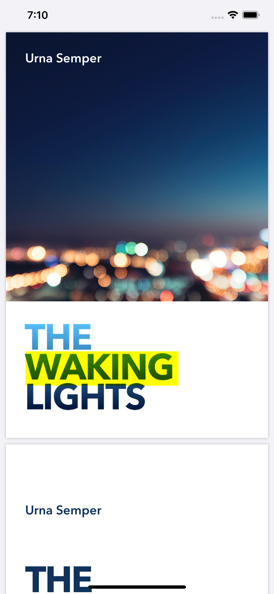

In this demo, we will be using PDFKit to View and Annotate PDF file. Let us start by selecting a Single View App template and name the project as PDFDemo.

[](https://secureservercdn.net/45.40.144.200/bpm.c63.myftpupload.com/wp-content/uploads/2020/04/1586512201_full.png?time=1586512307)

[](https://secureservercdn.net/45.40.144.200/bpm.c63.myftpupload.com/wp-content/uploads/2020/04/1586512223_full.png?time=1586512307)

For this demo, we will be using a PDF file “TheWakingLights.pdf” and this can downloaded from the [github](https://github.com/rshankras/Swift-Demo/tree/master/PDFDemo) project folder. Now drag and drop this file to Xcode project and in "Choose options for adding these files" select "Copy items if needed"

[](https://secureservercdn.net/45.40.144.200/bpm.c63.myftpupload.com/wp-content/uploads/2020/04/1586512500_full-1.png?time=1586512610)

#### Displaying PDF

In Xcode's project navigator, select ViewController.swift and add the following lines after viewDidLoad function.

```
  
            func openPDFDocument() {   
                guard let path = Bundle.main.url(forResource: "TheWakingLights",                        withExtension: "pdf")
                else { 
                 return     
                }      
                let document = PDFDocument(url: path)   
                let pdfView = PDFView(frame: view.frame)     
                pdfView.document = document       
                view.addSubview(pdfView)  

```

This function does the following

```
   guard let path = Bundle.main.url(forResource: "TheWakingLights",
                                         withExtension: "pdf") else { return }

```

Creates URL instance with the path of "TheWalkingLights.pdf" file.

Loads the pdf file in a PDFDocument object

```
 let document = PDFDocument(url: path)
```

Creates an instance of PDFView and sets the frame to ViewController's view then assigns the PDFDocument to PDFView instance.

```
        let pdfView = PDFView(frame: view.frame)
        pdfView.document = document
        view.addSubview(pdfView)

```

You will be seeing couple of **unresolved identified errors** because of missing **import PDFKit** statement. Add import statement after import UIKit and now you should be able to run the app on the simulator and select text on the PDF


#### Adding Annotation to PDF

PDFKit provides option to add annotation to PDF file using PDFAnnoation class. Various annotation can be added like Circle, line, Strikeout, Square, Underline, Highlight etc.. Let us see a code example of adding highlight to PDF page.

Add the following code snippet after openPDFDocument function.

```
  func highlightAnnotation() -> PDFAnnotation {
        let annotation = PDFAnnotation(bounds: CGRect(x: 30, y: 80, width: 230, height: 50),
                                       forType: .highlight, withProperties: nil)
        annotation.color = .yellow
        return annotation
    }

```

The above code does the following

1. Creates a PDFAnnotation instance by specifying coordinates for adding the annotation and setting the type of annotation to highlight.
2.  Then the annotation colour is set to yellow.

In the openDocument function add the following line after view.addSubView(pdfview)

```
   pdfView.currentPage?.addAnnotation(highlightAnnotation())

```

This gets the current page from PDFView and sets the highlight annotation. When you run the app on the simulation you will see the highlight as shown below.



Download the source code from [here](https://github.com/rshankras/Swift-Demo/tree/master/PDFDemo)
