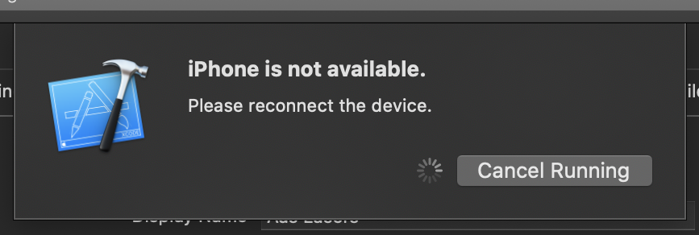
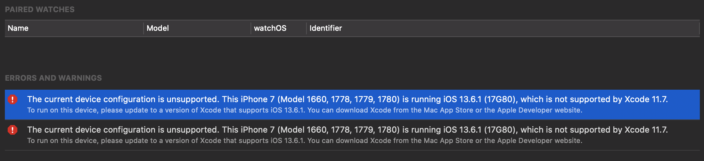

If you are receiving an error "iPhone is not available" when connecting Xcode with iPhone then check iOS version on your iPhone. Make sure it is compatible with the Xcode version.

The conflict in versions can be found under the Xcode - Window - Devices and Simulators. In my case the following error was mentioned.

"The current device configuration is unsupported. This iPhone 7 (Model 1660, 1778, 1779, 1780) is running iOS 13.6.1 (17G80), which is not supported by Xcode 11.7"

The fix was to upgrade iOS on my iPhone to iOS 13.7.
