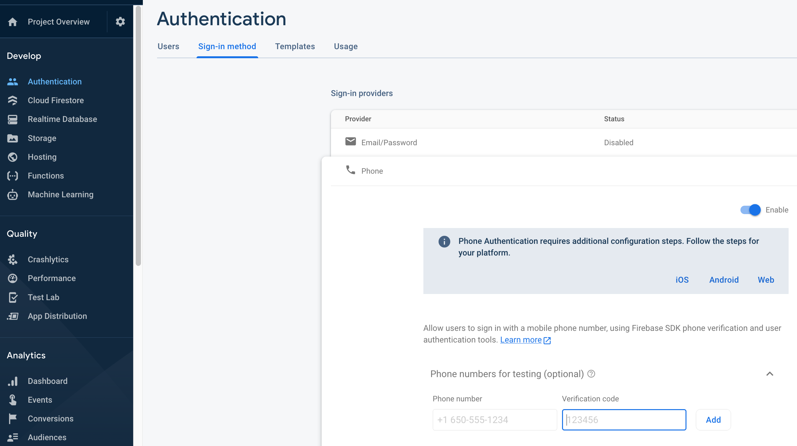

**Firebase enables apps with Phone Authentication** feature but when testing your app you might have received the following error.

> We have blocked all requests from this device due to unusual activity. Try again later.

This user usually occurs when you have received too many OTP's within a short period of time.  And we have to wait for an hour to start using the Phone Authentication feature again.

Recently Firebase has added a feature to add test numbers. This can be found under Firebase Console -> Authentication -> Sign-in method -> Phone

Now you can use "Phone numbers for testing" section to add test phone numbers. The test numbers will not be blocked and will not affect your testing. I believe you can also use the test numbers for Apple Approval process when publishing your app.
